# 🌳 Erdtree Self-Service Deployment Portal

[](https://portal.azure.com)
[](https://reactjs.org/)
[](https://terraform.io)
[](https://typescriptlang.org)

A comprehensive Azure infrastructure self-service portal that enables users to deploy Azure resources through an approval workflow using Azure Verified Modules and Terraform.

## 🚀 **Live Demo**

**Portal URL**: [https://erdtree-portal-prod-68648.azurewebsites.net](https://erdtree-portal-prod-68648.azurewebsites.net)

## 📋 **Features**

### **🎯 Self-Service Portal**
- **Resource Selection**: Choose from 6 Azure resource types with intuitive cards
- **Dynamic Forms**: Auto-generated forms based on Terraform variable schemas
- **Environment Selection**: Deploy to development or production environments
- **Subscription Management**: Support for multiple Azure subscriptions

### **🔐 Authentication & Security**
- **Azure AD Integration**: Single sign-on with Microsoft accounts
- **Role-Based Access Control**: Configurable user roles and permissions
- **Secure API Communication**: OAuth 2.0 with Azure AD tokens

### **📧 Approval Workflow**
- **Email-Based Approvals**: Automated approval requests to designated approvers
- **Logic App Integration**: Azure Logic Apps for workflow orchestration
- **Status Tracking**: Real-time deployment status and history

### **🏗️ Infrastructure as Code**
- **Azure Verified Modules**: Industry-standard Terraform modules
- **GitOps Workflow**: Infrastructure changes through version control
- **Automated Testing**: Terratest validation for infrastructure
- **Multi-Environment**: Separate configurations for dev/prod

### **📊 Monitoring & Governance**
- **Application Insights**: User behavior and performance monitoring
- **Audit Logging**: Complete trail of all deployment activities
- **Cost Management**: Budget alerts and cost tracking
- **Compliance**: Standard tags and governance policies

## 🏗️ **Architecture**

```mermaid
graph TB
    User[👤 User] --> Portal[🌐 React Portal]
    Portal --> AAD[🔐 Azure AD]
    Portal --> LogicApp[🔄 Logic App]
    LogicApp --> Approver[📧 Approver Email]
    LogicApp --> GitHub[📁 GitHub Actions]
    GitHub --> Terraform[🏗️ Terraform]
    Terraform --> AVM[📦 Azure Verified Modules]
    AVM --> Azure[☁️ Azure Resources]
    Portal --> AppInsights[📊 Application Insights]
    GitHub --> Tests[🧪 Terratest]
```



## 📦 **Supported Azure Resources**

| Resource Type | Icon | Description | Status |
|---------------|------|-------------|--------|
| **Windows VM** | 🖥️ | Windows Server virtual machines | ✅ Ready |
| **Linux VM** | 🐧 | Linux virtual machines (Ubuntu, RHEL, etc.) | ✅ Ready |
| **Storage Account** | 💾 | Blob, file, and queue storage | ✅ Ready |
| **Virtual Network** | 🌐 | VNets with subnets and NSGs | ✅ Ready |
| **Web App** | 🌍 | App Service for web applications | ✅ Ready |
| **Load Balancer** | ⚖️ | Traffic distribution and high availability | ✅ Ready |
| **Application Gateway** | 🚪 | Layer 7 load balancer with SSL termination | 🚧 Planned |
| **Azure Database** | 🗄️ | Managed database services | 🚧 Planned |

## 🚀 **Quick Start**

### **Prerequisites**
- Azure subscription with Contributor access
- Node.js 18+ for local development
- Azure CLI or Azure PowerShell
- Git for version control

### **1. Clone Repository**
```bash
git clone https://github.com/YOUR_USERNAME/erdtree-self-service.git
cd erdtree-self-service
```

### **2. Deploy Infrastructure**
```bash
# Option A: Azure CLI
az deployment group create \
  --resource-group erdtree-portal-rg \
  --template-file scripts/erdtree-infrastructure.json

# Option B: Azure Portal
# Use the ARM template in scripts/erdtree-infrastructure.json
```

### **3. Configure Azure AD**
```bash
# Create app registration
az ad app create \
  --display-name "Erdtree Self-Service Portal" \
  --web-redirect-uris "https://your-app.azurewebsites.net"

# Add API permissions (see docs/DEPLOYMENT.md for details)
```

### **4. Deploy Frontend**
```bash
cd frontend/
npm install
npm run build

# Deploy to Azure App Service
az webapp deployment source config-zip \
  --resource-group erdtree-portal-rg \
  --name your-web-app \
  --src build.zip
```

### **5. Test Portal**
1. Navigate to your Web App URL
2. Sign in with Azure AD
3. Select a resource and test the workflow

## 📖 **Documentation**

### **📚 Getting Started**
- [📋 Deployment Guide](docs/DEPLOYMENT.md) - Complete step-by-step deployment
- [⚙️ Configuration](docs/CONFIGURATION.md) - Portal and Azure configuration
- [🧪 Testing Guide](docs/TESTING.md) - How to test the portal

### **🔧 Development**
- [🏗️ Architecture](docs/ARCHITECTURE.md) - System design and components
- [💻 Development Setup](docs/DEVELOPMENT.md) - Local development environment
- [🔌 API Reference](docs/API.md) - Backend API documentation

### **🚀 Operations**
- [📊 Monitoring](docs/MONITORING.md) - Observability and alerting
- [🔒 Security](docs/SECURITY.md) - Security considerations
- [💰 Cost Management](docs/COST_MANAGEMENT.md) - FinOps and optimization

### **📑 Reference**
- [🏷️ Terraform Variables](docs/TERRAFORM_VARIABLES.md) - All configurable parameters
- [📧 Email Templates](docs/templates/) - Approval and notification templates
- [🔧 Troubleshooting](docs/TROUBLESHOOTING.md) - Common issues and solutions

## 🛠️ **Technology Stack**

### **Frontend**
- **React 18** - Modern UI framework
- **TypeScript** - Type safety and developer experience
- **TailwindCSS** - Utility-first CSS framework
- **Azure MSAL** - Microsoft Authentication Library
- **React Hook Form** - Form validation and management

### **Backend & Infrastructure**
- **Azure App Service** - Hosting platform
- **Azure Logic Apps** - Workflow orchestration
- **Azure AD** - Identity and access management
- **Application Insights** - Monitoring and telemetry
- **Azure Storage** - File and state storage

### **Infrastructure as Code**
- **Terraform** - Infrastructure provisioning
- **Azure Verified Modules** - Standardized Terraform modules
- **GitHub Actions** - CI/CD pipelines
- **Terratest** - Infrastructure testing
- **Terradocs** - Documentation generation

## 🏷️ **Standard Tags**

All deployed resources include consistent tags for governance:

| Tag | Value | Purpose |
|-----|-------|---------|
| `deployedBy` | Hermes | Deployment source tracking |
| `managedBy` | Terraform | Infrastructure management |
| `environment` | dev/prod | Environment classification |
| `application` | erdtree-portal | Application grouping |
| `resourceType` | vm/storage/etc | Resource categorization |
| `deploymentId` | unique-id | Deployment traceability |

## 📊 **Monitoring & Observability**

### **Application Insights Dashboards**
- **User Analytics**: Portal usage and adoption metrics
- **Performance**: Response times and error rates
- **Deployment Metrics**: Success rates and resource preferences
- **Cost Tracking**: Resource deployment costs over time

### **Log Analytics Queries**
```kusto
// Deployment audit trail
AzureActivity
| where ResourceProvider == "Microsoft.Resources"
| where Properties contains "erdtree"
| project TimeGenerated, Caller, ActivityStatusValue, ResourceGroup

// User authentication events
SigninLogs
| where AppDisplayName == "Erdtree Self-Service Portal"
| summarize Count=count() by UserPrincipalName, ResultType
```

## 💰 **Cost Management**

### **Current Costs** (Free Tier Deployment)
- **App Service**: $0/month (Free tier)
- **Application Insights**: $0/month (first 5GB free)
- **Storage Account**: ~$1/month (minimal usage)
- **Azure AD**: $0/month (included)

### **Production Costs** (Estimated)
- **App Service Basic**: ~$13/month
- **Logic Apps**: ~$10/month
- **Application Insights**: ~$5/month
- **Storage**: ~$2/month
- **Total**: ~$30/month

## 🔒 **Security**

### **Authentication**
- Azure AD integration with OAuth 2.0
- Role-based access control (RBAC)
- Multi-factor authentication support
- Conditional access policies

### **Data Protection**
- All communications over HTTPS
- Secrets stored in Azure Key Vault
- No sensitive data in logs or telemetry
- Regular security scanning

### **Compliance**
- SOC 2 Type II (Azure platform)
- ISO 27001 (Azure platform)
- GDPR compliance for EU users
- Audit logging for all activities

## 🤝 **Contributing**

We welcome contributions! Please see our [Contributing Guide](CONTRIBUTING.md) for details.

### **Development Workflow**
1. Fork the repository
2. Create a feature branch
3. Make your changes
4. Add tests if applicable
5. Submit a pull request

### **Code Standards**
- TypeScript for type safety
- ESLint for code quality
- Prettier for formatting
- Conventional commits for git history

## 📝 **License**

This project is licensed under the MIT License - see the [LICENSE](LICENSE) file for details.

## 🆘 **Support**

### **Getting Help**
- 📖 **Documentation**: Check the `/docs` folder
- 🐛 **Issues**: Submit GitHub issues for bugs
- 💡 **Feature Requests**: Use GitHub discussions
- 📧 **Contact**: hemirafl@microsoft.com

### **Community**
- 💬 **Discussions**: GitHub Discussions for Q&A
- 📺 **Demos**: Monthly demo sessions
- 📚 **Wiki**: Detailed guides and tutorials

## 🎯 **Roadmap**

### **v1.1 - Enhanced Resources** (Q2 2025)
- [ ] Azure Database support (SQL, PostgreSQL, MySQL)
- [ ] Application Gateway with SSL
- [ ] Azure Kubernetes Service (AKS)
- [ ] Network Security Groups

### **v1.2 - Advanced Features** (Q3 2025)
- [ ] Resource scheduling and lifecycle management
- [ ] Cost optimization recommendations
- [ ] Multi-region deployments
- [ ] Integration with Azure DevOps

### **v2.0 - Enterprise Features** (Q4 2025)
- [ ] Custom resource definitions
- [ ] Advanced RBAC with custom roles
- [ ] API for external integrations
- [ ] Advanced analytics and reporting

---

## 🏆 **Acknowledgments**

- **Azure Verified Modules Team** - For standardized Terraform modules
- **Microsoft Azure Team** - For the robust cloud platform
- **Terraform Community** - For infrastructure as code excellence
- **React Community** - For the amazing frontend framework

---

<div align="center">

**Built with ❤️ for the Azure community**

[🌐 Live Demo](https://erdtree-portal-prod-68648.azurewebsites.net) • [📖 Documentation](docs/) • [🐛 Issues](https://github.com/YOUR_USERNAME/erdtree-self-service/issues) • [💡 Discussions](https://github.com/YOUR_USERNAME/erdtree-self-service/discussions)

</div>
